#### Source of Exercises: Berkeley CS 285: Deep Reinforcement Learning, Decision Making, and Control

## Homework 2:

##### Environment1:

##### Reward-to-go:

##### Baseline-average-reward:

##### Continuous action space:

#### Implementation:

#### 1. Policy Gradients

#### sample action from prob. distr. 

-n 1:   Specifies the number of iterations for training. Each iteration consists of a series of actions 
        taken by the agent in the environment, followed by a training step to improve the policy 
        until a terminal state is reached or the maximum number of steps is exceeded.

-b 1:   Batch size, which indicates the number of collected state-action pairs used per iteration. 
        A batch size of 1 means that an update is made after each individual state-action pair. 
        Typically, larger values are used for more stable learning.

## Task1, 100 iterations/episodes: 
#### no critic use q-values, no reward-to-go
python cs285/scripts/run_hw2.py --env_name CartPole-v0 -n 100 -b 1000 --exp_name experiment1

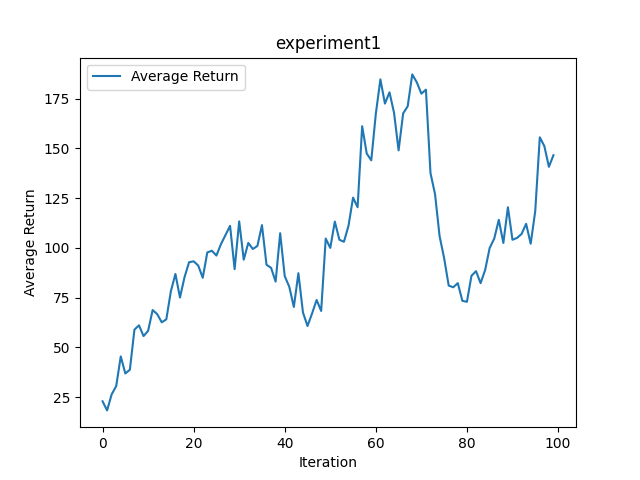

#### no critic use q-values, reward-to-go
python cs285/scripts/run_hw2.py --env_name CartPole-v0 -n 100 -b 1000 -rtg --exp_name experiment2

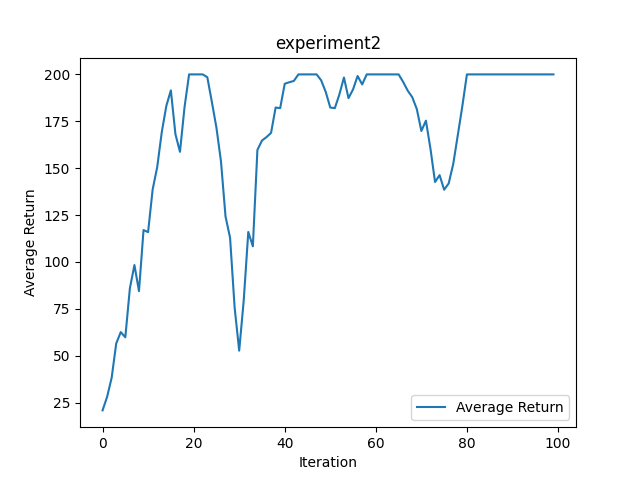

#### no critic use q-values, no reward-to-go, Normalize advantage
python cs285/scripts/run_hw2.py --env_name CartPole-v0 -n 100 -b 1000 -na --exp_name experiment3

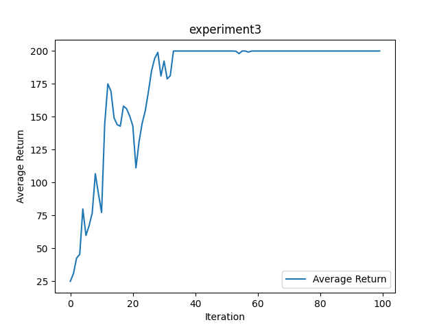

#### no critic use q-values, reward-to-go, Normalize advantage
python cs285/scripts/run_hw2.py --env_name CartPole-v0 -n 100 -b 1000 -na --exp_name experiment4

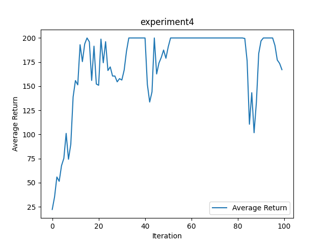

#### no critic use q-values, no reward-to-go, batch_size 4000
python cs285/scripts/run_hw2.py --env_name CartPole-v0 -n 100 -b 4000 --exp_name experiment5

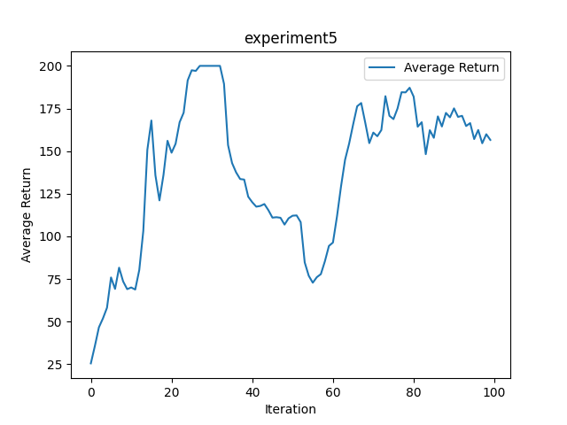

#### no critic use q-values, reward-to-go, batch_size 4000
python cs285/scripts/run_hw2.py --env_name CartPole-v0 -n 100 -b 4000 --exp_name experiment6

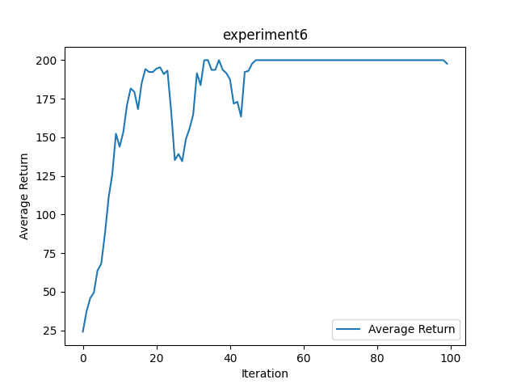

#### no critic use q-values, no reward-to-go, Normalize advantage, batch_size 4000
python cs285/scripts/run_hw2.py --env_name CartPole-v0 -n 100 -b 4000 -na --exp_name experiment7

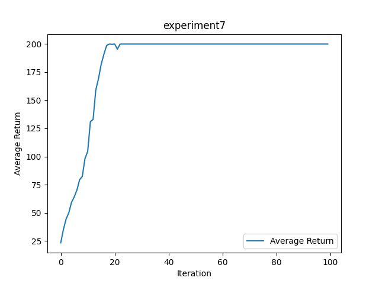

#### no critic use q-values, reward-to-go, Normalize advantage, batch_size 4000
python cs285/scripts/run_hw2.py --env_name CartPole-v0 -n 100 -b 4000 -rtg -na --exp_name experiment8

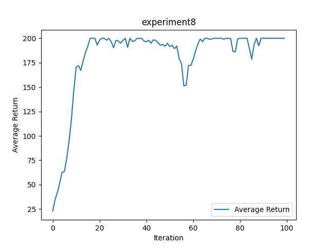

### Task2, Using a Neural Network Baseline

##### Environment2:

### Continous, new env

#### no critic use q-values, reward-to-go, batch_size 5000
python cs285/scripts/run_hw2.py --env_name HalfCheetah-v4 -n 100 -b 5000 -rtg --discount 0.95 -lr 0.01 --exp_name experiment9

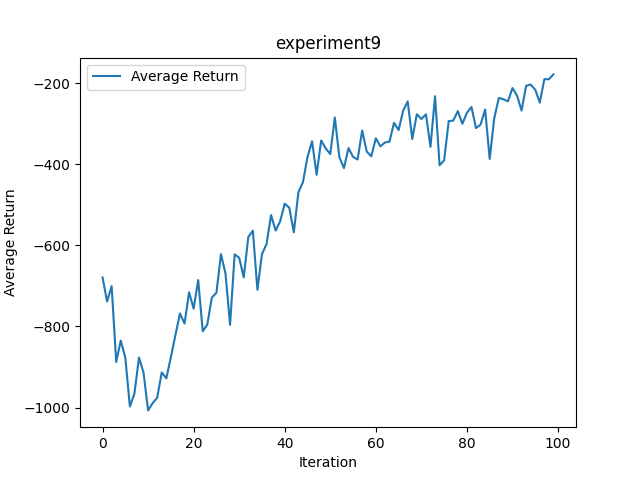

#### with critic NN (Baseline), reward-to-go, batch_size 5000

python cs285/scripts/run_hw2.py --env_name HalfCheetah-v4 -n 100 -b 5000 -rtg --discount 0.95 -lr 0.01 --use_baseline -blr 0.01 -bgs 5 
--exp_name experiment10

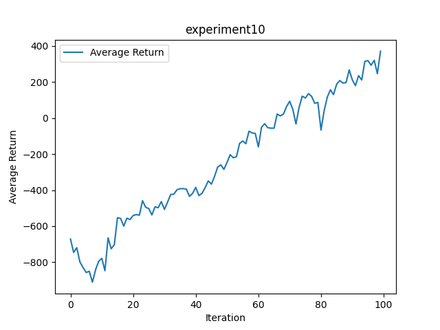

### Task3, Generalized Advantage Estimation

##### Environment3:

#### lamda 0.95

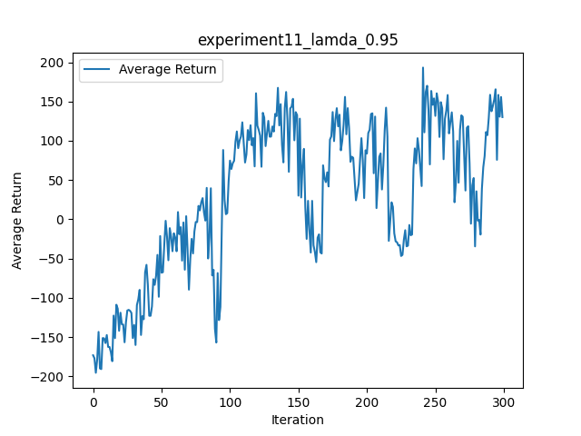

#### lamda 0.98

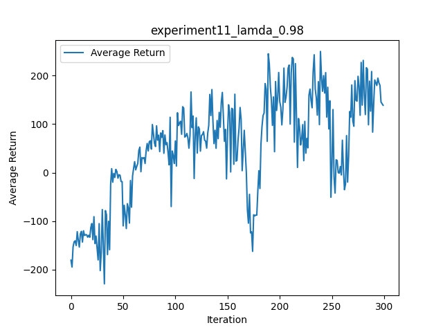

#### lamda 1

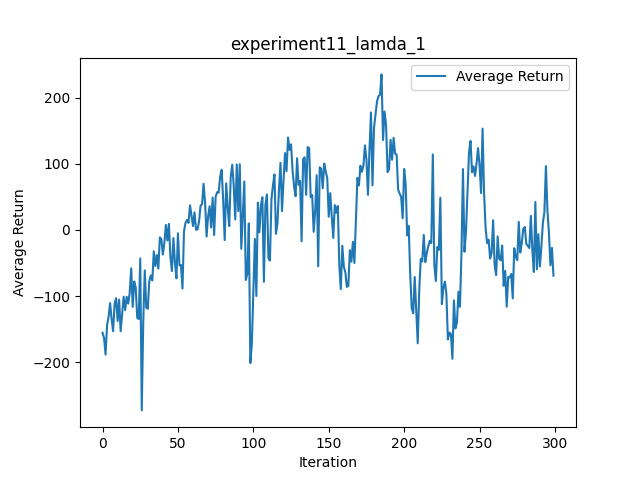