#### Source: https://rail.eecs.berkeley.edu/deeprlcourse/

## Homework 1:

### Behavioral Cloning

<pre style="font-size: 16px; font-weight: bold;">
    python cs285/scripts/run_hw1.py \
    --expert_policy_file cs285/policies/experts/Ant.pkl \
    --env_name Ant-v4 --exp_name bc_ant --n_iter 1 \
    --expert_data cs285/expert_data/expert_data_Ant-v4.pkl \
    --video_log_freq 1
</pre>

### DAgger

<pre style="font-size: 16px; font-weight: bold;">
     python cs285/scripts/run_hw1.py \
     -expert_policy_file cs285/policies/experts/Ant.pkl \
     -env_name Ant-v4 --exp_name dagger_ant --n_iter 10 \
     -do_dagger --expert_data cs285/expert_data/expert_data_Ant-v4.pkl \
     -video_log_freq 1
</pre>

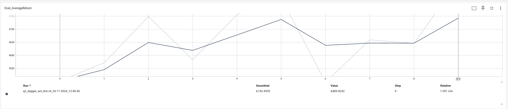

######################################################################################

## Homework 2:

##### Environment1:

##### Reward-to-go:

##### Baseline-average-reward:

##### Continuous action space:

#### Implementation:

#### 1. Policy Gradients

#### sample action from prob. distr. 

-n 1:   Specifies the number of iterations for training. Each iteration consists of a series of actions 
        taken by the agent in the environment, followed by a training step to improve the policy 
        until a terminal state is reached or the maximum number of steps is exceeded.

-b 1:   Batch size, which indicates the number of collected state-action pairs used per iteration. 
        A batch size of 1 means that an update is made after each individual state-action pair. 
        Typically, larger values are used for more stable learning.

## Task1, 100 iterations/episodes: 
#### no critic, no reward-to-go
###### 1. python cs285/scripts/run_hw2.py --env_name CartPole-v0 -n 100 -b 1000 --exp_name cartpole

#### no critic, reward-to-go
###### 2. python cs285/scripts/run_hw2.py --env_name CartPole-v0 -n 100 -b 1000 -rtg --exp_name cartpole_rtg

#### no critic, no reward-to-go, Normalize advantage
###### 3. python cs285/scripts/run_hw2.py --env_name CartPole-v0 -n 100 -b 1000 -na --exp_name cartpole_na

#### no critic, reward-to-go, Normalize advantage
###### 4. python cs285/scripts/run_hw2.py --env_name CartPole-v0 -n 100 -b 1000 -rtg -na --exp_name cartpole_rtg_na

#### no critic, no reward-to-go, batch_size 4000
###### 1. python cs285/scripts/run_hw2.py --env_name CartPole-v0 -n 100 -b 4000 --exp_name cartpole_lb

#### no critic, reward-to-go, batch_size 4000
###### 2. python cs285/scripts/run_hw2.py --env_name CartPole-v0 -n 100 -b 4000 -rtg --exp_name cartpole_lb_rtg

#### no critic, no reward-to-go, Normalize advantage, batch_size 4000
###### 3. python cs285/scripts/run_hw2.py --env_name CartPole-v0 -n 100 -b 4000 -na --exp_name cartpole_lb_na

#### no critic, reward-to-go, Normalize advantage, batch_size 4000
###### 4.python cs285/scripts/run_hw2.py --env_name CartPole-v0 -n 100 -b 4000 -rtg -na --exp_name cartpole_lb_rtg_na

### Task2, Using a Neural Network Baseline

##### Continous Environment2:

#### no critic use q-values, reward-to-go, batch_size 5000
###### 1. python cs285/scripts/run_hw2.py --env_name HalfCheetah-v4 -n 100 -b 5000 -rtg --discount 0.95 -lr 0.01 --exp_name cheetah

#### with critic NN (Baseline), reward-to-go, batch_size 5000

###### 2. python cs285/scripts/run_hw2.py --env_name HalfCheetah-v4 -n 100 -b 5000 -rtg --discount 0.95 -lr 0.01 --use_baseline -blr 0.01 -bgs 5 --exp_name cheetah_baseline

### Task3, Generalized Advantage Estimation

##### Environment3:

###### python cs285/scripts/run_hw2.py --env_name LunarLander-v2 --ep_len 1000 --discount 0.99 -n 300 -l 3 -s 128 -b 2000 -lr 0.001 --use_reward_to_go --use_baseline --gae_lambda <λ> --exp_name lunar_lander_lambda<λ>

### Task4: Different seeds and hyperparameters

<pre style="font-size: 16px; font-weight: bold;">
for seed in $(seq 1 5); do
    python cs285/scripts/run_hw2.py --env_name InvertedPendulum-v4 -n 100 --exp_name pendulum_tune_lr0.005_bs2000_s$seed -rtg --use_baseline -na --batch_size 2000 --seed $seed --learning_rate 0.005
done
</pre>

<pre style="font-size: 16px; font-weight: bold;">
for lr in 0.001 0.005 0.01; do          # Verschiedene Lernraten testen
    for bs in 1000 2000 5000; do        # Verschiedene Batch-Größen testen
        python cs285/scripts/run_hw2.py \
            --env_name InvertedPendulum-v4 \
            -n 100 \
            --exp_name pendulum_tune_lr${lr}_bs${bs} \
            -rtg \
            --use_baseline \
            -na \
            --batch_size $bs \
            --learning_rate $lr
    done
done
</pre>

### Task5

##### Environment4:

https://www.gymlibrary.dev/environments/mujoco/humanoid/

<pre style="font-size: 16px; font-weight: bold;">
    SSH video rendering: xvfb-run -s "-screen 0 1400x900x24" python cs285/scripts/run_hw2.py --env_name Humanoid-v4 --ep_len 1000 --discount 0.99 -n 1 -l 3 -s 256 -b 50000 -lr 0.001 --baseline_gradient_steps 50 -na --use_reward_to_go --use_baseline --gae_lambda 0.97 --exp_name humanoid --video_log_freq 5
</pre>

<pre style="font-size: 16px; font-weight: bold;">
    tensorboard --logdir=.
</pre>

######################################################################################

## Homework 3:

#### Basic Q-Learning, basic DQN algorithm

<pre style="font-size: 16px; font-weight: bold;">
    python cs285/scripts/run_hw3_dqn.py -cfg experiments/dqn/lunarlander.yaml --seed 1
    python cs285/scripts/run_hw3_dqn.py -cfg experiments/dqn/lunarlander.yaml --seed 2
</pre>

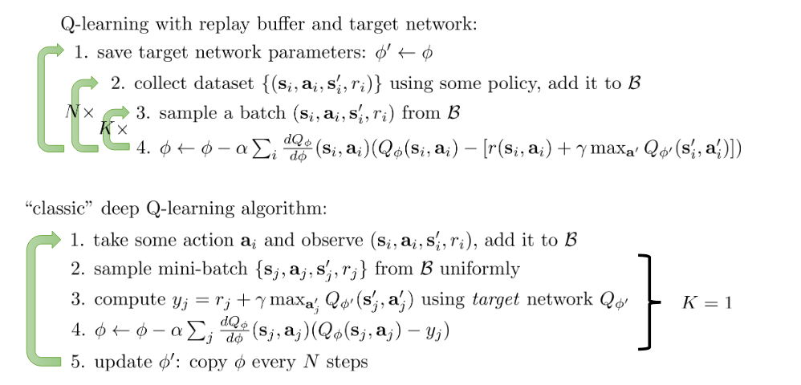

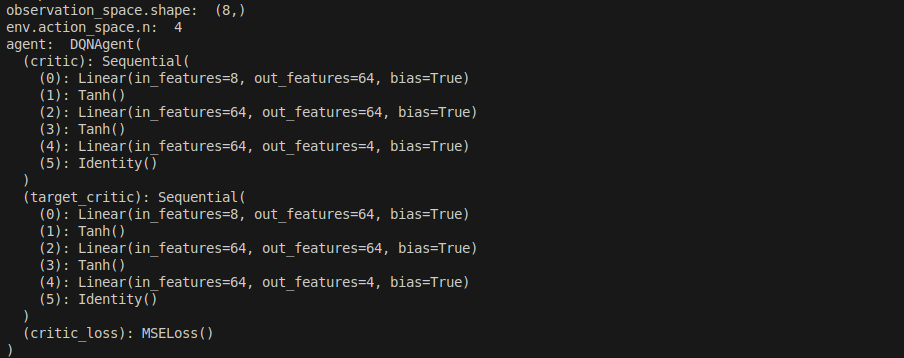

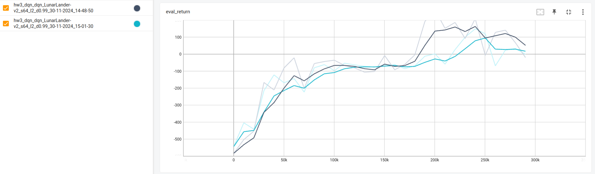

#### Double Q-Learning

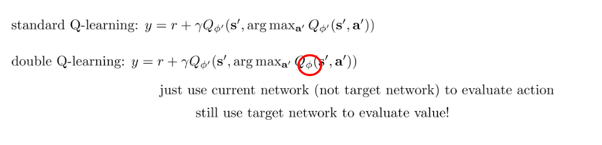

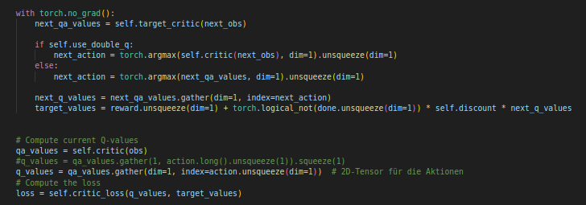

<pre style="font-size: 16px; font-weight: bold;">
    python cs285/scripts/run_hw3_dqn.py -cfg experiments/dqn/lunarlander_doubleq.yaml --seed 1
    python cs285/scripts/run_hw3_dqn.py -cfg experiments/dqn/lunarlander_doubleq.yaml --seed 2
</pre>

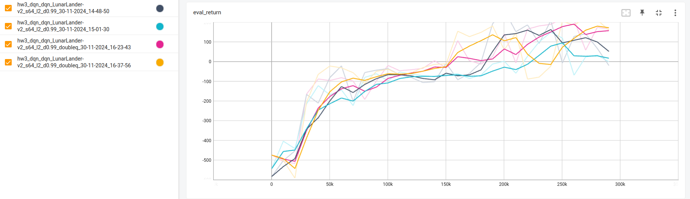

<pre style="font-size: 16px; font-weight: bold;">
    python cs285/scripts/run_hw3_dqn.py -cfg experiments/dqn/mspacman.yaml    
</pre>

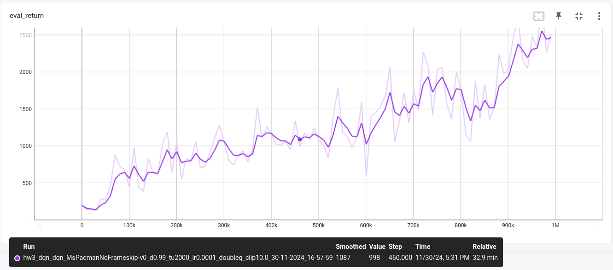

#### Continuous Actions with Soft-Actor-Critic:

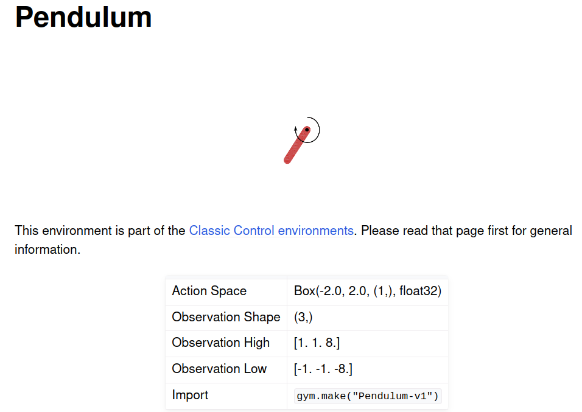

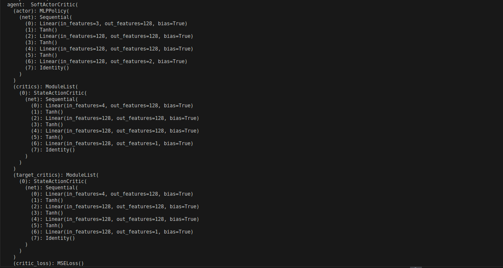

### Actor: Class MLP_Policy
Take an observation and output a distribution over actions. Options depending on config file.

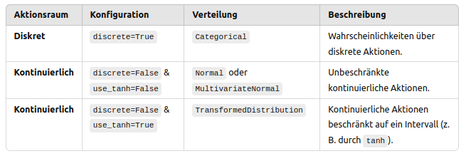

### Critics: Class StateActionCritic

Critic: Q(s,a)≈r+γQ(s′,a′)

Mehrere Critic-Netzwerke können verwendet werden, z. B. für Double Q-Learning oder Redundant Q-Learning
Ein Critic ist ein vollständig verbundenes neuronales Netzwerk (MLP), das die Eingabe (s,a)(s,a) verarbeitet und einen einzigen QQ-Wert ausgibt.

Mechanismen zum Einsatz mehrerer Critic-Netzwerke
- Unabhängige QQ-Netzwerke
- Minimale QQ-Schätzung (Clipped Double Q):
- Mittelwert der QQ-Schätzungen
- REDQ (Redundant Q-Learning)

Jedes Critic-Netzwerk wird separat trainiert und liefert eine Schätzung für Q(s,a)Q(s,a).

Update Critic:

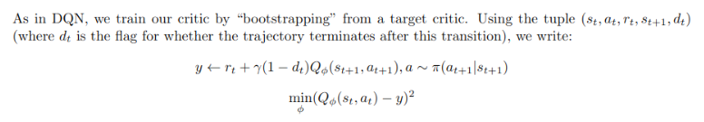

### Target_critics: Class StateActionCritic

Die Target Critic-Netzwerke werden für das Bootstrapping verwendet. Sie liefern stabile Zielwerte für die Bellman-Gleichung.

y=r+γ(1−d)Qtarget​(s′,a′)

Updates:

Soft Update: Die Target-Netzwerke werden langsam an die Critic-Netzwerke angepasst (Polyak averaging):
    θ′←τθ+(1−τ)θ′

Hard Update: Die Target-Netzwerke werden periodisch vollständig auf die Werte der Critic-Netzwerke gesetzt:
    θ′←θ

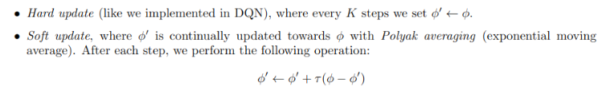

### Entropy 
In continuous spaces, we have several options for generating exploration noise. One of the most common is providing an entropy bonus to encourage the actor to have high entropy (i.e. to
be “more random”), scaled by a “temperature” coefficient β. 

Testing:

<pre style="font-size: 16px; font-weight: bold;">
    python cs285/scripts/run_hw3_sac.py -cfg experiments/sac/sanity_pendulum.yaml
</pre>

Testing:

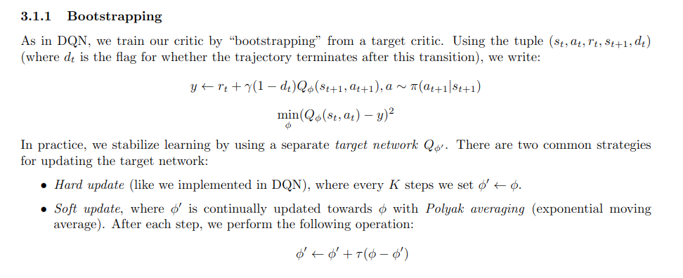

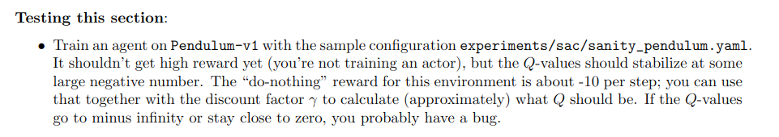

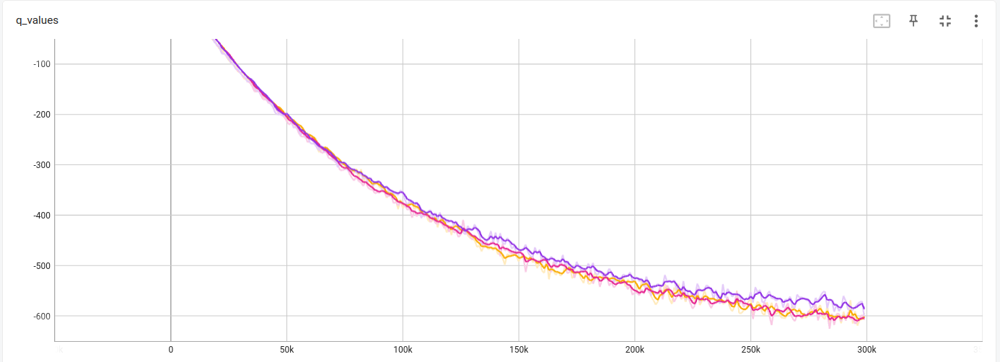

Testing entropy: 

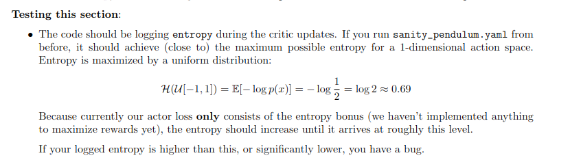

Compare entropy if actor trained with actor loss only consists of the entropy bonus (lila) or without (yellow, pink), no maximizing return !

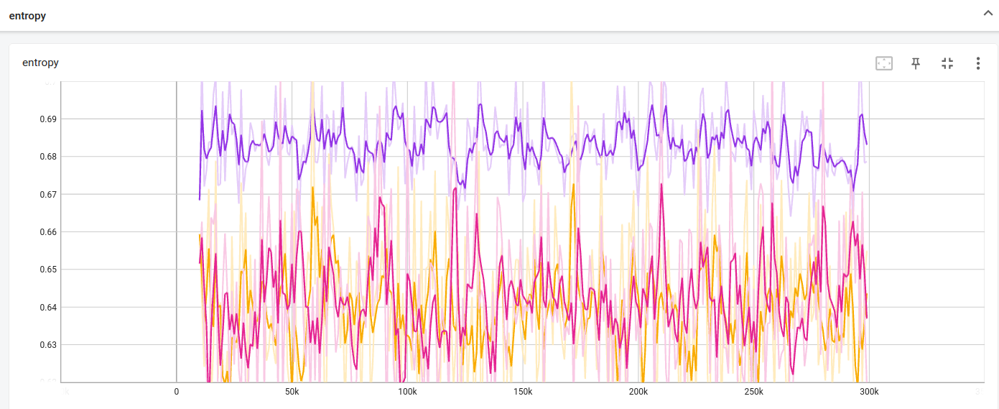

For this experiment: num_critic_networks=1

python cs285/scripts/run_hw3_sac.py -cfg experiments/sac/sanity_invertedpendulum_reinforce.yaml

python cs285/scripts/run_hw3_sac.py -cfg experiments/sac/sanity_invertedpendulum_reparametrize.yaml

######################################################################################

## Homework4:

#### ENV: conda activate cs285hw3

### Model-based Reinforcement Learning:
- Learn Dynamic Model
- Action Selection via random-shooting optimization and CEM
- On-Policy data collection
- Ensembles

#### Task1:
Collect a large dataset by executing random actions. Train a neural network dynamics model on this fixed
dataset.

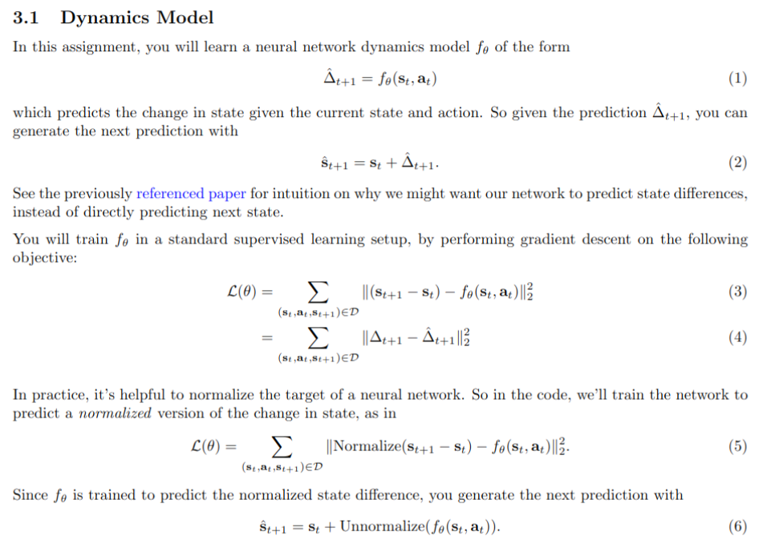

MBRL with ensemble models:

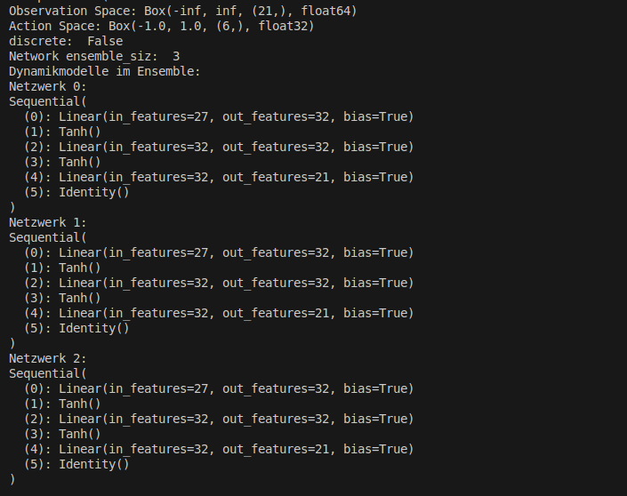

<pre style="font-size: 16px; font-weight: bold; width: 800px;">
    python cs285/scripts/run_hw4.py -cfg experiments/mpc/halfcheetah_0_iter.yaml
</pre>

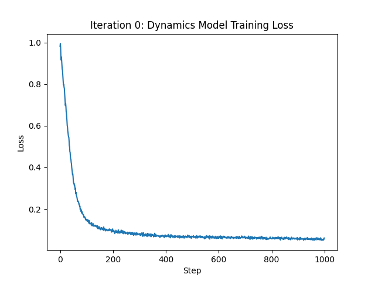

#### Task2:
Action selection using your learned dynamics model and a given reward function.

Model Predictice Control:
We first collect data with our policy (which starts as random), we
train our model on that collected data, we evaluating the resulting MPC policy (which now uses the trained
model), and repeat.

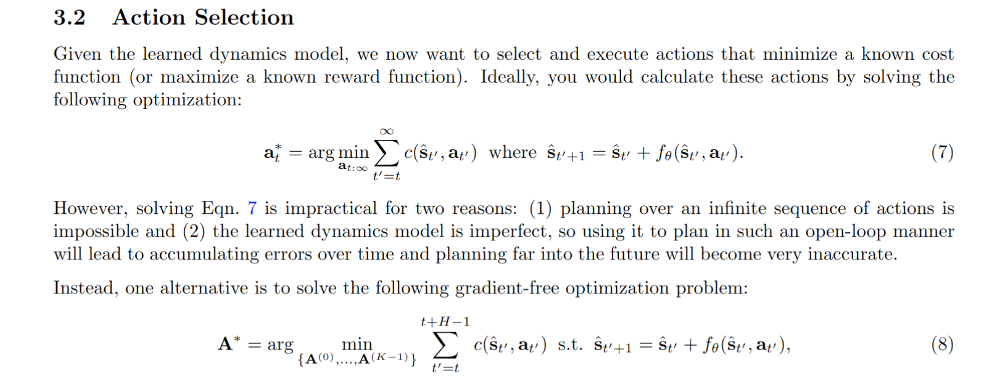

MPC is based on the following core ideas:
Planning over a Horizon: MPC searches for a sequence of actions over multiple timesteps (the "horizon") to maximize the expected reward. Prediction Model: MPC uses a dynamic model to predict how actions will influence future states and rewards.
Receding Horizon: Although an entire sequence is planned, only the first action of the best sequence is executed. The process is then repeated for the next timestep.

The "random" strategy is a simple version of MPC because it implements the core principles of MPC, albeit without sophisticated optimization of action sequences:
Planning over a Horizon: Multiple random action sequences of length TT (horizon) are generated. Each sequence represents a potential plan for future actions. Prediction with a Model: A trained dynamic model is used to predict how each action sequence will affect future states and rewards.
Evaluation: Each action sequence is evaluated by summing up the rewards for the entire sequence. This corresponds to optimizing the objective in MPC (e.g., maximizing reward or minimizing error).
Execution: As with MPC, only the first action of the best sequence is executed.

<pre style="font-size: 16px; font-weight: bold; width: 800px;">
python cs285/scripts/run_hw4.py -cfg experiments/mpc/obstacles_1_iter.yaml
</pre>

Average eval return: -25.955617904663086

#### Task3:

MBRL algorithm with on-policy data collection and iterative model training. On-policy is used, the collected data comes from the currently trained combination of dynamic model and MPC. Although there is no explicitly trained policy as in classical reinforcement learning algorithms, the combination of dynamic model and MPC acts as a ‘policy’ that determines actions and collects data.

<pre style="font-size: 16px; font-weight: bold; width: 800px;">
python cs285/scripts/run_hw4.py -cfg experiments/mpc/obstacles_multi_iter.yaml
python cs285/scripts/run_hw4.py -cfg experiments/mpc/reacher_multi_iter.yaml
python cs285/scripts/run_hw4.py -cfg experiments/mpc/halfcheetah_multi_iter.yaml
</pre>

obstacles_multi_iter: 
    Average eval return:-26.595630645751953

reacher_multi_iter:
    Average eval return: -268.4715969465834

halfcheetah_multi_iter: 
    Average eval return: 421.34788151243447

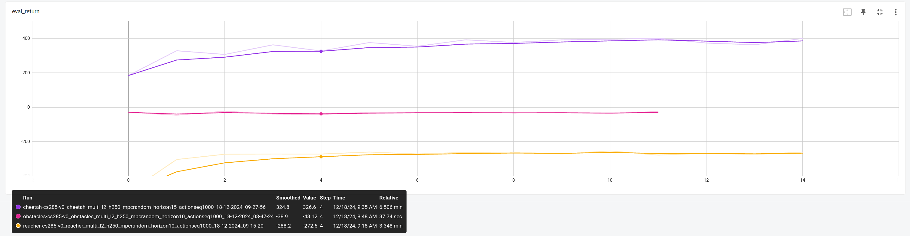

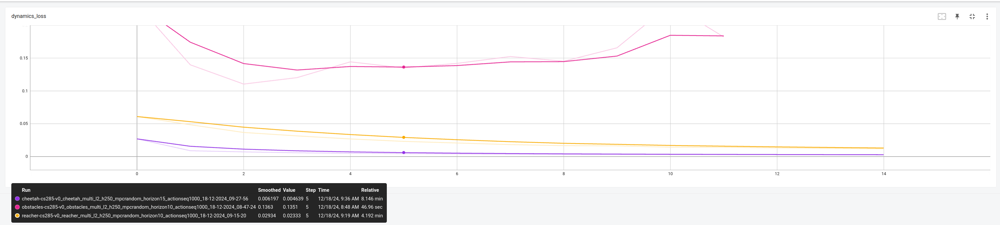

#### Task4:
Compare the performance of your MBRL algorithm as a function of three hyperparameters: the
number of models in your ensemble, the number of random action sequences considered during each action
selection, and the MPC planning horizon

<pre style="font-size: 16px; font-weight: bold; width: 800px;">
python cs285/scripts/run_hw4.py -cfg experiments/mpc/reacher_ablation.yaml
</pre>

fixed: num_layers: 2, hidden_size: 250, num_iters: 15, initial_batch_size: 5000, batch_size: 800, num_agent_train_steps_per_iter: 1000, num_eval_trajectories: 10, mpc_strategy: random

1. mpc_num_action_sequences: 1000, mpc_horizon: 10, ensemble_size: 3
    Average eval return: -259.5900037229883

2. mpc_num_action_sequences: 1250, mpc_horizon: 10, ensemble_size: 3
    Average eval return: -269.16030872614294

3. mpc_num_action_sequences: 1000, mpc_horizon: 15, ensemble_size: 3
    Average eval return: -279.0613245690755

4. mpc_num_action_sequences: 1000, mpc_horizon: 10, ensemble_size: 6
    Average eval return: -275.9346172796258

-> no improvement

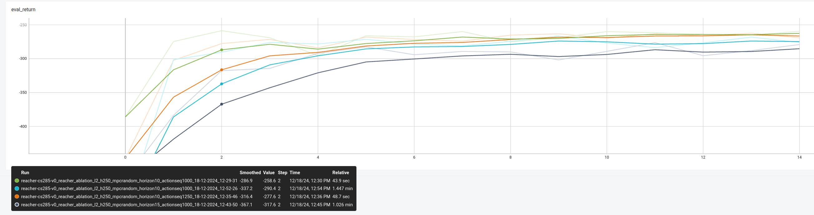

#### Task5:
You will compare the performance of your MBRL algorithm with action selecting performed by random-
shooting (what you have done up to this point) and CEM

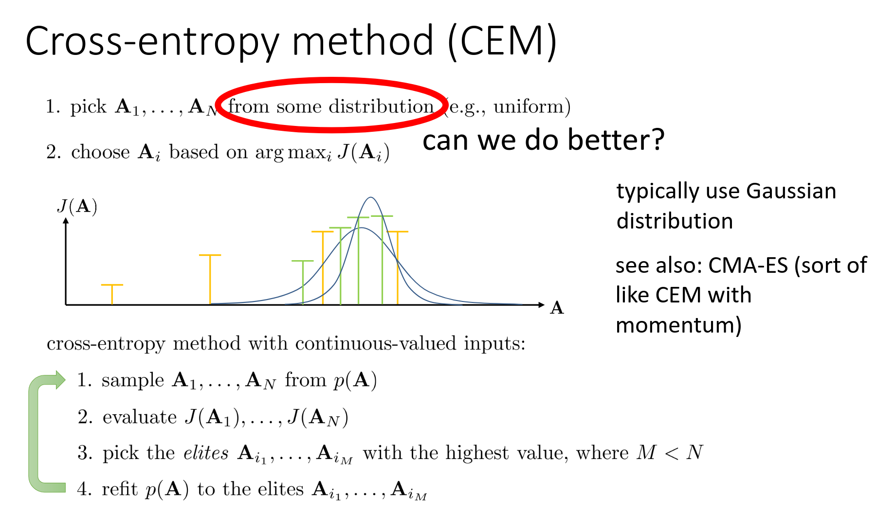

The CEM approach optimises the action selection iteratively:
- Initialise a distribution of possible action sequences.
- Generate sequences by sampling from this distribution.
- Evaluate the sequences based on the reward. 
- Select the best sequences (elites) and update the distribution.
- Repeat the process until the distribution prioritises the best actions.

At the end, CEM selects the first action of the optimised sequence as the next action to be executed.

<pre style="font-size: 16px; font-weight: bold; width: 800px;">
python cs285/scripts/run_hw4.py -cfg experiments/mpc/halfcheetah_cem.yaml
</pre>

#### Task6:  Model-Based Policy Optimization (MBPO)
In this homework you will also be implementing a variant of MBPO. Another way of leveraging the learned
model is through generating additional samples to train the policy and value functions. Since RL often
requires many environment interaction samples, which can be costly, we can use our learned model to generate
additional samples to improve sample complexity. In MBPO, we build on your SAC implementation from HW3
and use the learned model you implemented in the earlier questions for generating additional samples to train
our SAC agent

Learn Policy:

Observation Space: Box(-inf, inf, (21,), float64)
Action Space: Box(-1.0, 1.0, (6,), float32)
discrete:  False

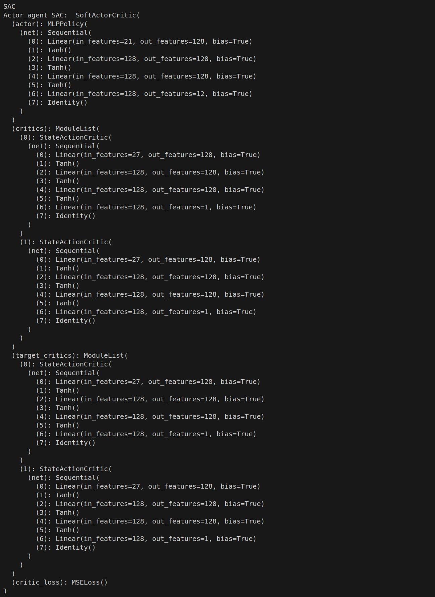

1. The policy network (actor) generates actions based on the current state ss.
Network structure of the actor:
Input: The current state ss, which consists of 21 dimensions (in_features=21). 
Output: The output has 12 dimensions (out_features=12), which represents the parameters of a Gaussian policy:
6 values for the means of the actions.
6 values for the standard deviations of the actions
This means that the actor generates a probability distribution for the actions, and an action is chosen by sampling from this distribution.

2. Critics (Q-value networks) evaluate the quality of state-action pairs (s,a) by calculating the Q-value, which indicates the expected future reward.
Network structure of the critics:
There are two Q-value networks (double Q-learning) to avoid overfitting and provide more stable updates. 
Input: The combination of states s (21 dimensions) and action a (6 dimensions), totalling 27 dimensions (in_features=27).
Output: A single scalar (out_features=1) giving the Q-value for the given state-action pair (s,a).

3. The Target Critics are copies of the two Q-value networks.
They are used to perform more stable updates by using the soft target update mechanism.
θtarget←τ⋅θcritic+(1-τ)⋅θtarget 
θtarget←τ⋅θcritic+(1-τ)⋅θtarget

<pre style="font-size: 16px; font-weight: bold; width: 800px;">
python cs285/scripts/run_hw4.py -cfg experiments/mpc/halfcheetah_mbpo.yaml --sac_config_file experiments/sac/halfcheetah_clipq.yaml
</pre>

The different settings (Model-Free SAC, Dyna, MBPO) differ in how and from where the training data originates.

1. (grey) Model-free SAC baseline: no additional rollouts from the learned model.
Model-Free SAC Baseline: SAC agent is trained directly on real interactions with the environment.The replay buffer of the SAC agent only contains real observations, actions and rewards. There is no additional use of learnt models

2. (blue) Dyna (technically “dyna-style” - the original Dyna algorithm is a little different): add single-step rollouts
from the model to the replay buffer and incorporate additional gradient steps per real world step. Here, single-step rollouts are generated with the learnt dynamic model and added to the replay buffer of the SAC agent.
This additional data improves the sampling efficiency as the SAC agent sees not only real but also simulated data.
For each real interaction in the environment, additional gradient steps are performed to further optimise the policy.
The SAC agent optimises its policy based on the mix of data.

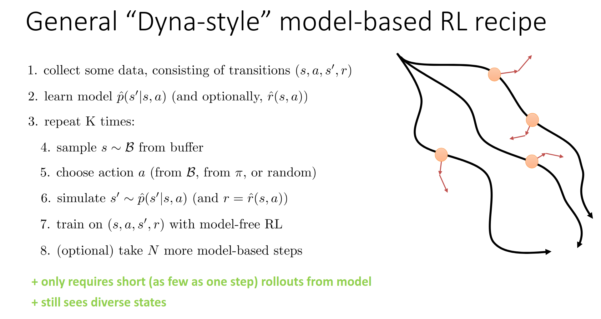

3. (pink) MBPO: add in 10-step rollouts from the model to the replay buffer and incorporate additional gradient
steps per real world step: Here, longer, multi-step rollouts (e.g. 10 steps) are generated with the dynamic model and added to the replay buffer. These simulated rollouts provide even more data, which is used to train the SAC agent.
Again, additional gradient steps are performed per real environment interaction. The SAC agent processes both the real and simulated data to learn a better policy. The multi-step rollouts are more challenging as errors in the dynamics model prediction can accumulate over several steps.

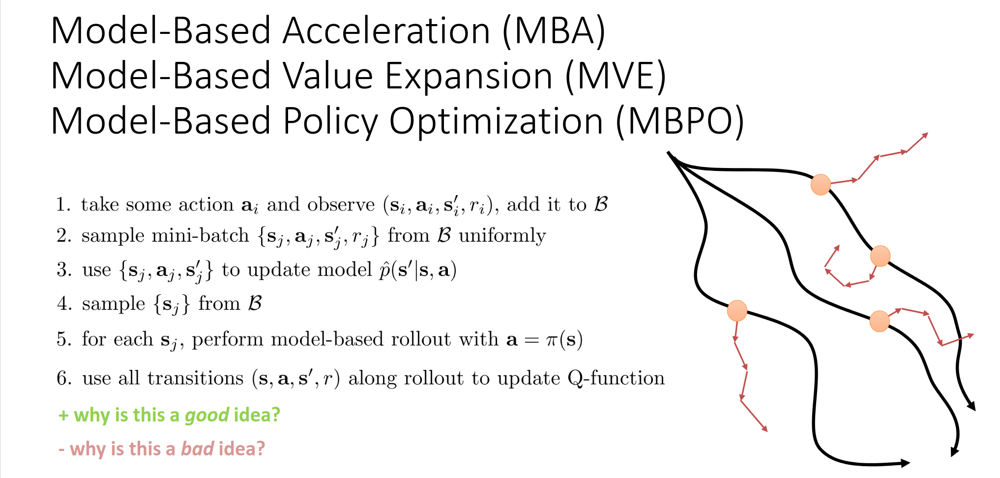

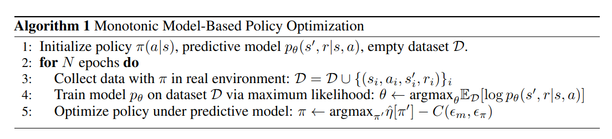

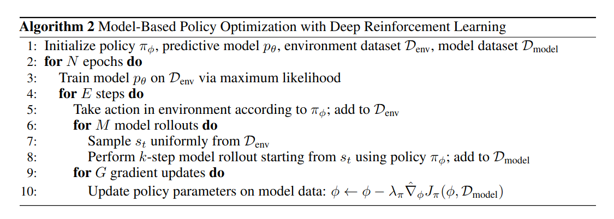

Overview modules:
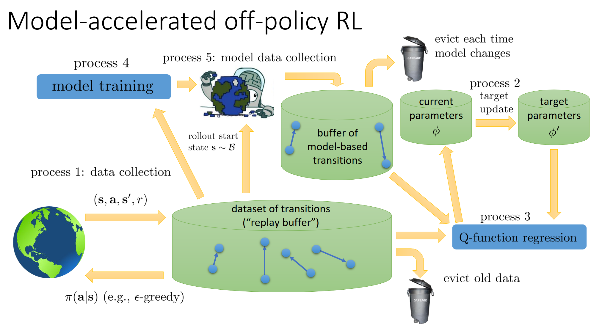

Results:
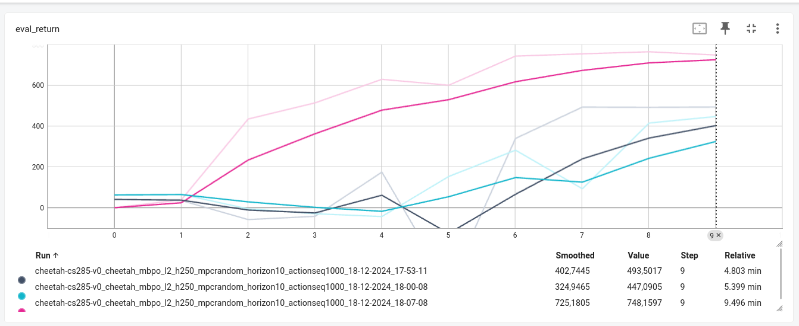
#################################################################################

