#### Source of Exercises: Berkeley CS 285: Deep Reinforcement Learning, Decision Making, and Control

## Homework 2:

##### Environment1:
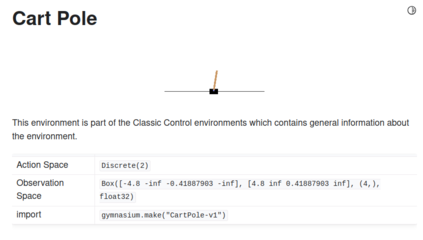

##### Reward-to-go:
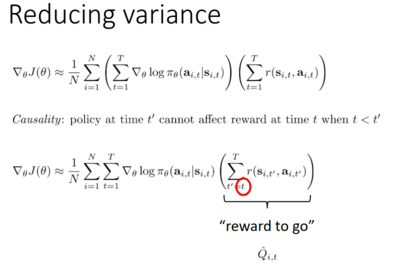

##### Baseline-average-reward:
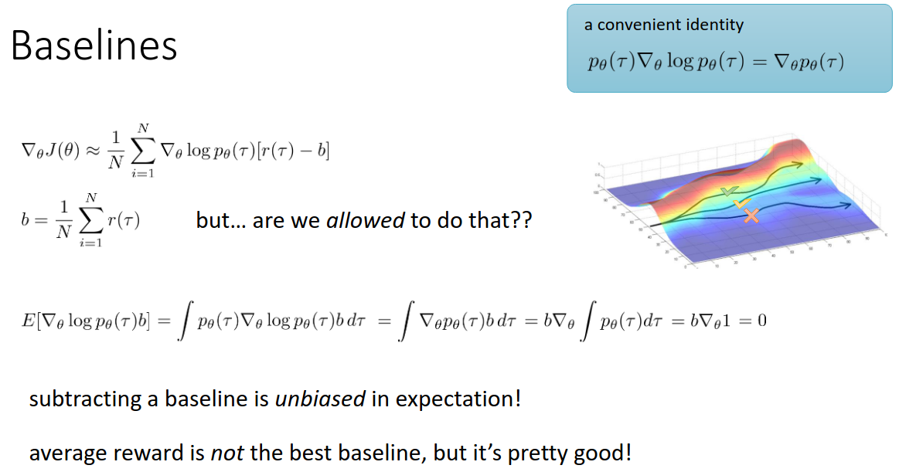

##### Continuous action space:
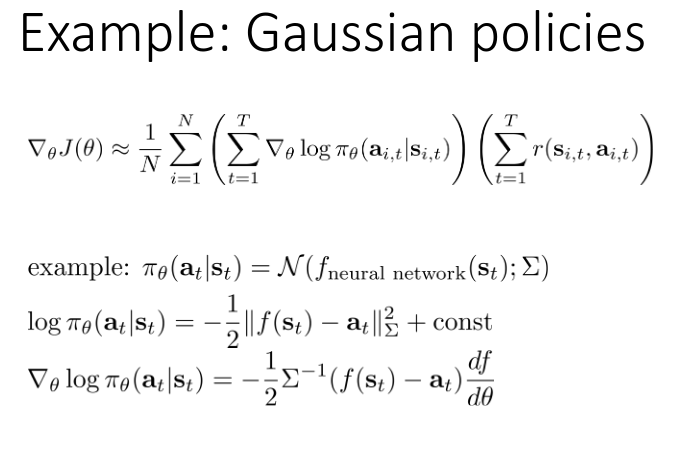

#### Implementation:

#### 1. Policy Gradients
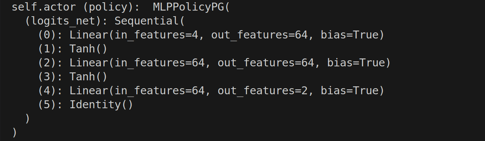

#### sample action from prob. distr. 
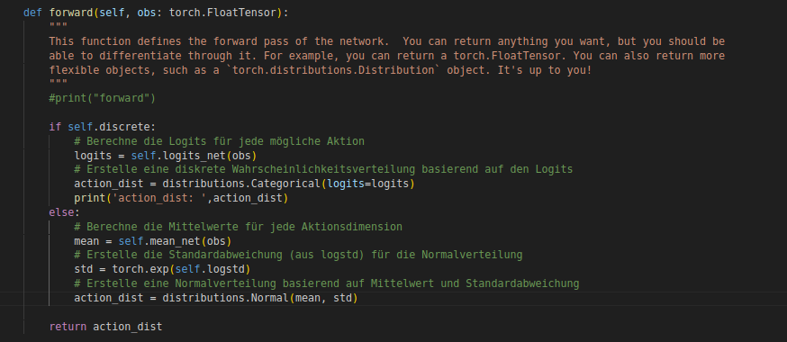

-n 1:   Specifies the number of iterations for training. Each iteration consists of a series of actions 
        taken by the agent in the environment, followed by a training step to improve the policy 
        until a terminal state is reached or the maximum number of steps is exceeded.

-b 1:   Batch size, which indicates the number of collected state-action pairs used per iteration. 
        A batch size of 1 means that an update is made after each individual state-action pair. 
        Typically, larger values are used for more stable learning.

## Task1, 100 iterations/episodes: 
#### no critic, no reward-to-go
###### 1. python cs285/scripts/run_hw2.py --env_name CartPole-v0 -n 100 -b 1000 --exp_name cartpole

#### no critic, reward-to-go
###### 2. python cs285/scripts/run_hw2.py --env_name CartPole-v0 -n 100 -b 1000 -rtg --exp_name cartpole_rtg

#### no critic, no reward-to-go, Normalize advantage
###### 3. python cs285/scripts/run_hw2.py --env_name CartPole-v0 -n 100 -b 1000 -na --exp_name cartpole_na

#### no critic, reward-to-go, Normalize advantage
###### 4. python cs285/scripts/run_hw2.py --env_name CartPole-v0 -n 100 -b 1000 -rtg -na --exp_name cartpole_rtg_na

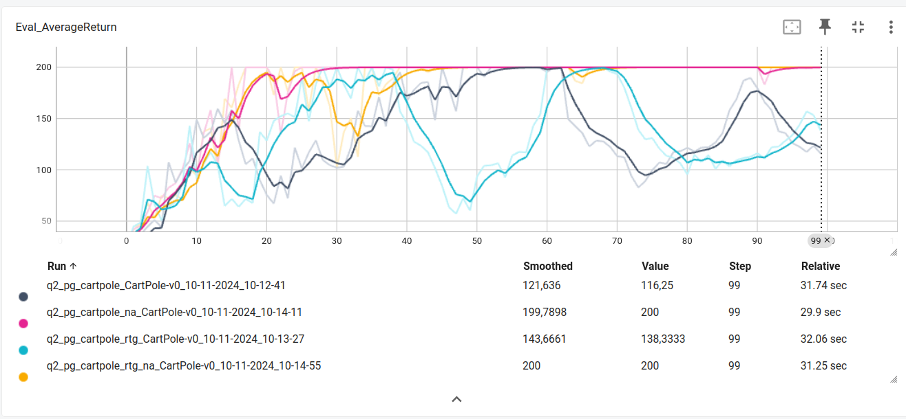

#### no critic, no reward-to-go, batch_size 4000
###### 1. python cs285/scripts/run_hw2.py --env_name CartPole-v0 -n 100 -b 4000 --exp_name cartpole_lb

#### no critic, reward-to-go, batch_size 4000
###### 2. python cs285/scripts/run_hw2.py --env_name CartPole-v0 -n 100 -b 4000 -rtg --exp_name cartpole_lb_rtg

#### no critic, no reward-to-go, Normalize advantage, batch_size 4000
###### 3. python cs285/scripts/run_hw2.py --env_name CartPole-v0 -n 100 -b 4000 -na --exp_name cartpole_lb_na

#### no critic, reward-to-go, Normalize advantage, batch_size 4000
###### 4.python cs285/scripts/run_hw2.py --env_name CartPole-v0 -n 100 -b 4000 -rtg -na --exp_name cartpole_lb_rtg_na

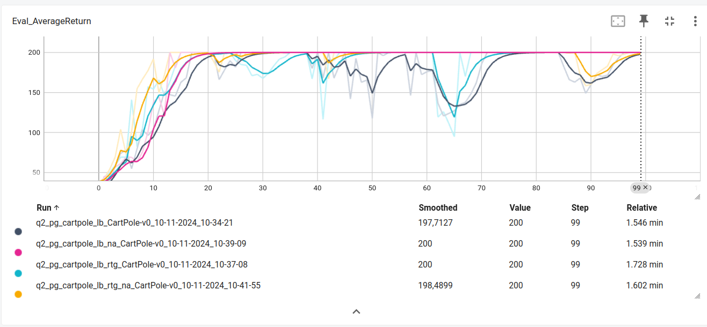

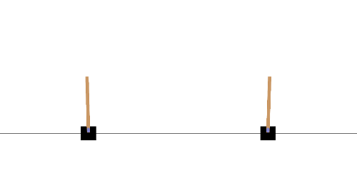

### Task2, Using a Neural Network Baseline

##### Continous Environment2:

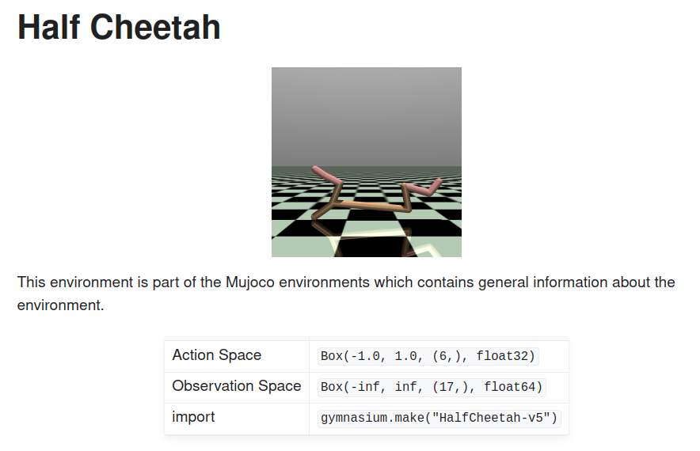

#### no critic use q-values, reward-to-go, batch_size 5000
###### 1. python cs285/scripts/run_hw2.py --env_name HalfCheetah-v4 -n 100 -b 5000 -rtg --discount 0.95 -lr 0.01 --exp_name cheetah

#### with critic NN (Baseline), reward-to-go, batch_size 5000
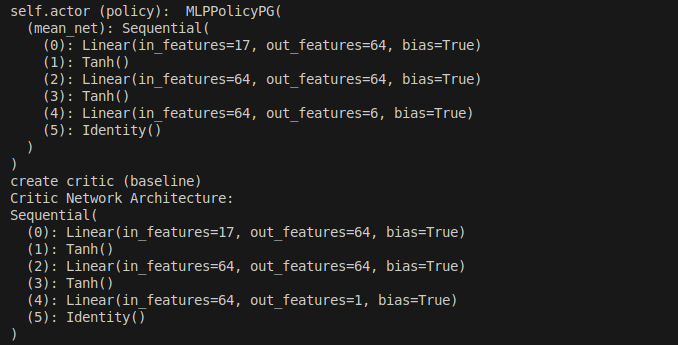

###### 2. python cs285/scripts/run_hw2.py --env_name HalfCheetah-v4 -n 100 -b 5000 -rtg --discount 0.95 -lr 0.01 --use_baseline -blr 0.01 -bgs 5 --exp_name cheetah_baseline

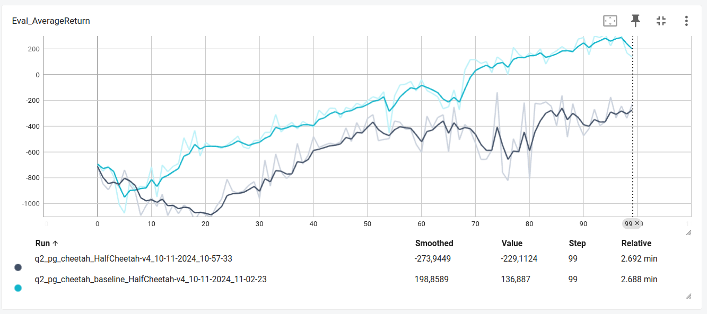

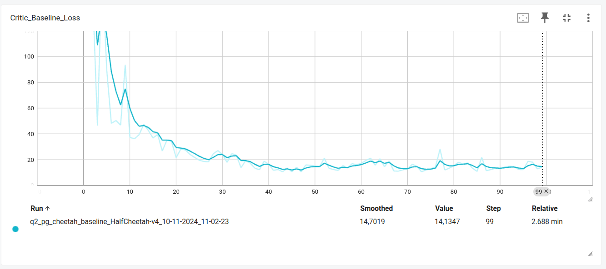

### Task3, Generalized Advantage Estimation

##### Environment3:
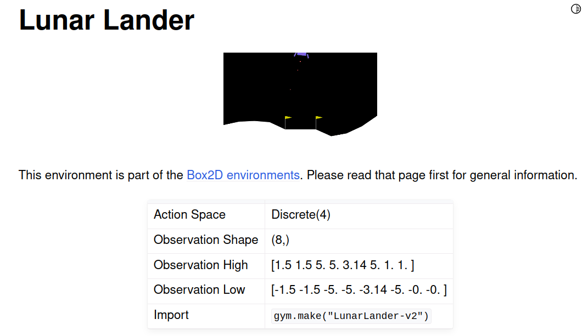

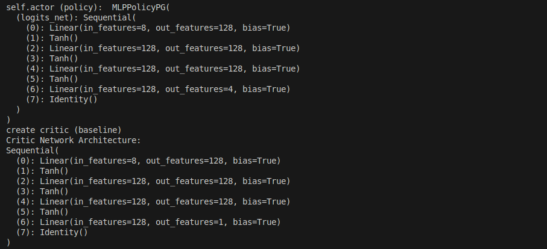

###### python cs285/scripts/run_hw2.py --env_name LunarLander-v2 --ep_len 1000 --discount 0.99 -n 300 -l 3 -s 128 -b 2000 -lr 0.001 --use_reward_to_go --use_baseline --gae_lambda <λ> --exp_name lunar_lander_lambda<λ>

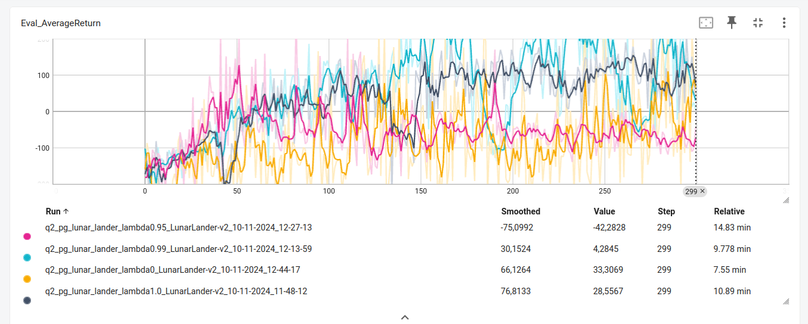

### Task4: Different seeds and hyperparameters

<pre style="font-size: 16px; font-weight: bold;">
for seed in $(seq 1 5); do
    python cs285/scripts/run_hw2.py --env_name InvertedPendulum-v4 -n 100 --exp_name pendulum_tune_lr0.005_bs2000_s$seed -rtg --use_baseline -na --batch_size 2000 --seed $seed --learning_rate 0.005
done
</pre>

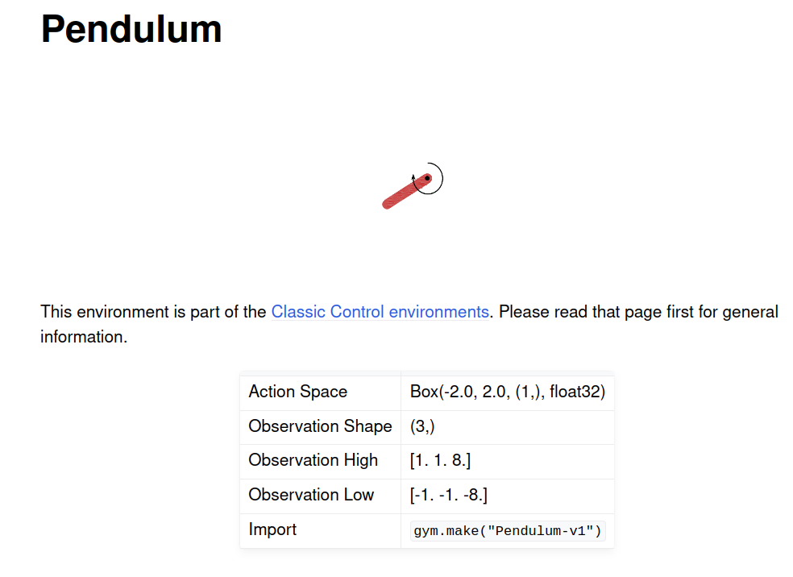

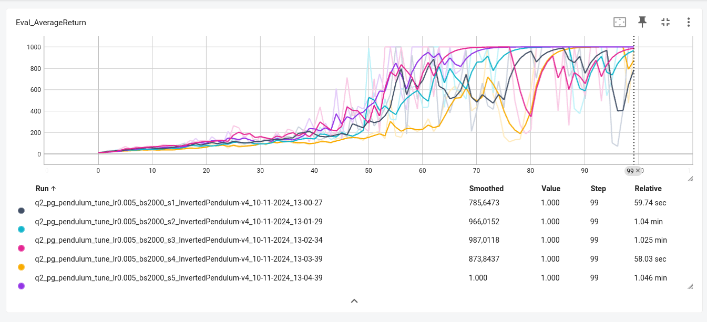

<pre style="font-size: 16px; font-weight: bold;">
for lr in 0.001 0.005 0.01; do          # Verschiedene Lernraten testen
    for bs in 1000 2000 5000; do        # Verschiedene Batch-Größen testen
        python cs285/scripts/run_hw2.py \
            --env_name InvertedPendulum-v4 \
            -n 100 \
            --exp_name pendulum_tune_lr${lr}_bs${bs} \
            -rtg \
            --use_baseline \
            -na \
            --batch_size $bs \
            --learning_rate $lr
    done
done
</pre>

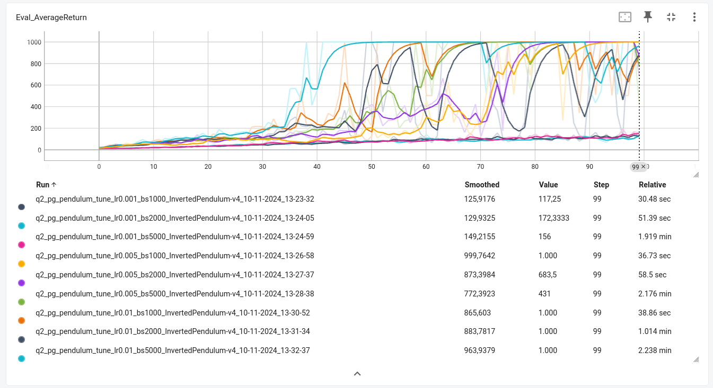

### Task5

##### Environment4:
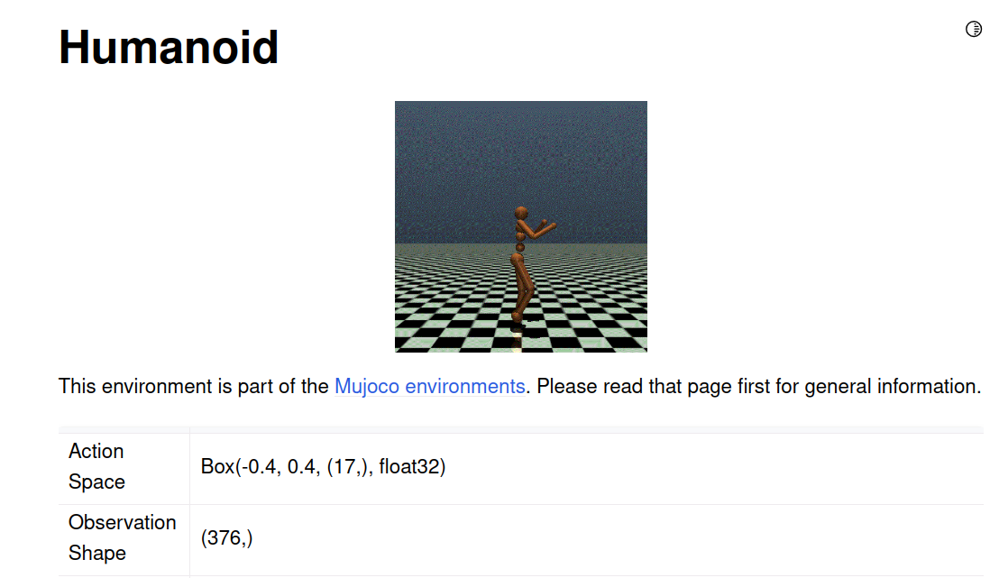

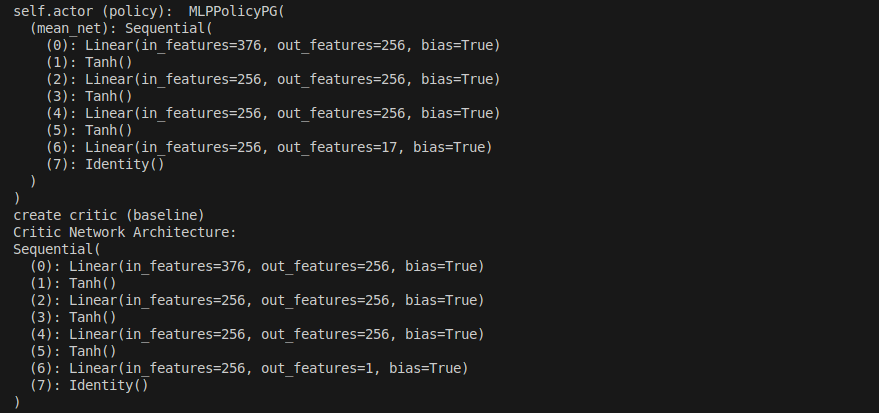

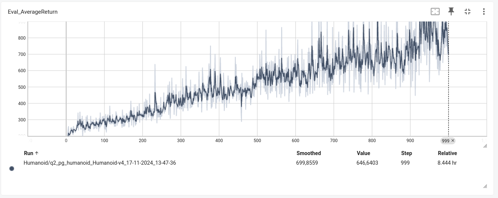

https://www.gymlibrary.dev/environments/mujoco/humanoid/

SSH video rendering: xvfb-run -s "-screen 0 1400x900x24" python cs285/scripts/run_hw2.py --env_name Humanoid-v4 --ep_len 1000 --discount 0.99 -n 1 -l 3 -s 256 -b 50000 -lr 0.001 --baseline_gradient_steps 50 -na --use_reward_to_go --use_baseline --gae_lambda 0.97 --exp_name humanoid --video_log_freq 5

tensorboard --logdir=.