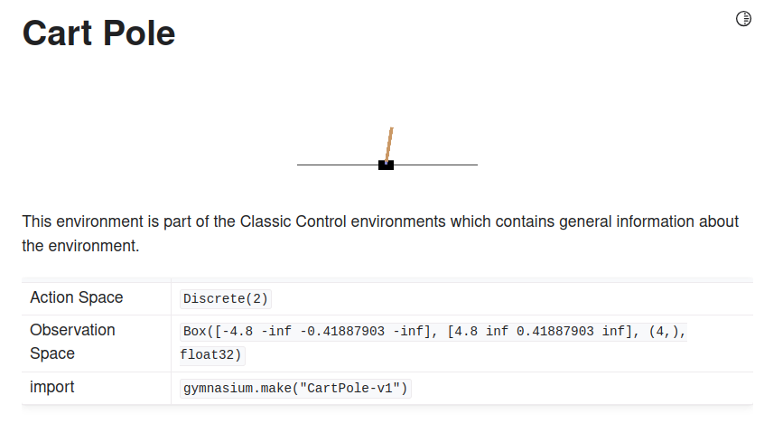

Source of Exercises: Berkeley CS 285: Deep Reinforcement Learning, Decision Making, and Control

### Homework 2:

##### Environment Experiment1:

##### Reward-to-go:

##### Baseline:

##### Contonious:

